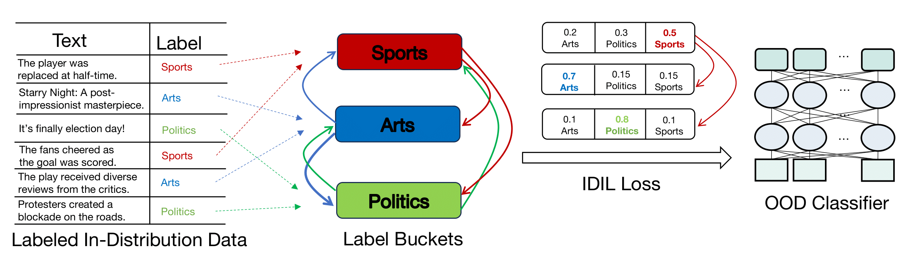

# SELFOOD: Self-Supervised Out-Of-Distribution Detection via Learning to Rank
This repository provides the code for training SELFOOD with *IDIL Loss* presented in the paper "[SELFOOD: Self-Supervised Out-Of-Distribution Detection via Learning to Rank](https://arxiv.org/abs/2305.14696)" accepted to EMNLP 2023.

## SELFOOD Framework Diagram



## Getting Started
### Requirements
```
* cuda 11.6
* python 3.8.16
* huggingface-hub==0.12.1
* torch==1.13.1
* torchvision==0.14.1 
* TODO transformers==
```
### Datasets
* Clima, NYT, TREC, Yelp
* Datasets can be found under the `datasets/` folder
* For out-of-domain datasets, we set the label column to be a random label from the in-domain dataset labels

## Training
### Arguments (TODO remove ce_loss_lambda, add --idil_loss as argument)
| Args 	| Type 	| Description 	| Default|
|---------|--------|----------------------------------------------------|:-----:|
| seed 	| [int] 	| experiment seed | 42 |
| epochs 	| [int] 	| epochs | 8 |
| batch_size 	| [int] 	| batch size| 128|
| model 	| [str]	| bert-base-uncased, roberta-base | 	 bert-base-uncased |
| idil_loss 	| [flag] 	| Use IDIL loss | False	|
| output_dir 	| [str] 	| save files path	|  - |
| train_file 	| [str] 	| training file path	|  - |
| validation_file 	| [str] 	| validation file path	|  - |
| ind_test_file 	| [str] 	| indomain evaluation file path	|  - |
| ood_test_file 	| [str] 	| OOD evaluation file path	|  - |

### Command 
* Set the  `idil_loss` flag to train model with IDIL Loss.
``` 
python3 train_classifier.py --seed 21   --model  bert-base-uncased --train_file data/clima/clima_indomain/train.pkl --validation_file data/clima/clima_indomain/validation.pkl --max_length 512 --train_batch_size 8 --output_dir models/clima/clima_indomain/idil_loss/   --idil_loss --num_train_epochs 8 
```

[//]: # (## Train baseline models TODO no need of this)

[//]: # (* Remove the  `idil_loss` flag to train model with Cross-Entropy Loss.)

[//]: # ()
[//]: # (### Examples)

[//]: # (``` )

[//]: # (python3 train_classifier.py --seed 21   --model  bert-base-uncased --train_file data/clima/clima_indomain/train.pkl --validation_file data/clima/clima_indomain/validation.pkl --max_length 512 --train_batch_size 8 --output_dir models/clima/clima_indomain/ce_loss/   --with_wandb True --num_train_epochs 8 )

[//]: # (```)


#  Evaluate the trained model

### Evaluate against test data stored in  `ind_test_file_path` and `ood_ood_test_file_path` and calculate performance metrics.
``` 
python3  train_classifier.py --do_predict   --model   models/clima/clima_indomain/  --train_file data/clima/clima_indomain/train.pkl --validation_file data/clima/clima_indomain/validation.pkl --ind_test_file data/clima/clima_indomain/test.pkl  --ood_test_file data/nyt/nyt_ood/test.pkl  --max_length 512 --per_device_eval_batch_size 128 --output_dir results/clima/clima_vs_nyt/  

``` 

## Results
In the following table, we show a subset of the results from our paper. The in-domain and out-of-domain datasets are combinations of Yelp, NYT , Clima and TREC datasets. The results correspond to the FPR95, Detection Error, AUROC, AUPR computed using a model trained on IDIL loss. The model is trained only on the in-domain dataset.

TODO add more description about what is the in domain and ood datasets here and what's the classfier?
### Performance metrics
``` 
- FPR95
- Detection Error (ERR)
- AUROC
- AUPR
```


| Model    | Indomain-Dataset | OOD-Dataset | FPR95 | ERR  | AUROC | AUPR  |
|----------|------------------|-------------|-------|------|-------|-------|
| SELFOOD  | Yelp             | NYT         | 63.2  | 19.6 | 79.4  | 82.7  |
| CE Loss  | Yelp             | NYT         | 82.1  | 34.9 | 63.4  | 50.7  |
| SELFOOD  | Yelp             | Clima       | 17.6  | 4.8  | 97.9  | 96.4  |
| CE Loss  | Yelp             | Clima       | 83.2  | 27.8 | 48.6  | 37.0  |
| SELFOOD  | TREC             | NYT         | 0.0   | 0.0  | 100.0 | 100.0 |
| CE Loss  | TREC             | NYT         | 8.4   | 1.3  | 97.6  | 87.5  |


* More results can be found in the paper.


## Citation
```
@misc{mekala2023selfood,
      title={SELFOOD: Self-Supervised Out-Of-Distribution Detection via Learning to Rank}, 
      author={Dheeraj Mekala and Adithya Samavedhi and Chengyu Dong and Jingbo Shang},
      year={2023},
      eprint={2305.14696},
      archivePrefix={arXiv},
      primaryClass={cs.CL}
}
```